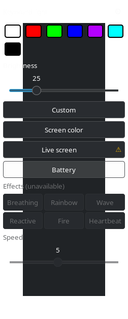

# Backlit

Keyboard backlight control for Linux laptops whose RGB backlight is exposed as a single
multicolor LED (`/sys/class/leds/rgb:kbd_backlight`, e.g. TUXEDO / Clevo / SAGER with `tuxedo-drivers`,
since these rebrand the same Clevo/Tongfang chassis).
A small floating GTK panel plus a command-line tool.



> **Note:** built and only tested on one laptop (TUXEDO/Clevo chassis, niri compositor). It should
> work on any device exposing the same `multi_intensity`/`brightness` sysfs interface, but if
> something doesn't, please open an issue rather than assume it's broken everywhere.

## Features

- **Colors**: standard swatches, saved favorites (right-click to rename or delete), a color wheel with hex input, and a brightness slider.
- **Screen color**: pick an area of the screen and use its dominant color, once (**Screen color**) or continuously (**Live screen**, adjustable rate).
- **Battery mode**: red (low) → yellow-green → light blue (full). Pulses while charging, blinks when low and when charging stops at the limit.
- **Effects**: Breathing, Rainbow, Wave, Reactive (flashes on key press), Fire, Heartbeat, with adjustable speed.
- **Persistence**: static color, battery mode and effects survive a reboot until you pick something else.
- **CLI** for keyboard shortcuts, and a UI in 10 languages (⚙ menu → Language).

The LED is a single zone, so everything applies to the whole keyboard. Only one mode is active at a time;
effects need a plain base color, so they are disabled while Battery or Live screen is on.

## Requirements

- Python 3 with PyGObject (GTK 3) and pycairo
- A kernel driver exposing `rgb:kbd_backlight` with `multi_intensity` / `brightness` (e.g. `tuxedo-drivers`)
- `systemd --user` (restore on login), `libnotify` (`notify-send`, launcher errors)
- `grim` and `slurp` for the screen modes (Wayland compositors with wlr-screencopy, e.g. niri, sway, Hyprland)

## Install

```bash
./install.sh
```

Copies the scripts to `~/.config/scripts`, installs and enables the restore service, and creates the
`.desktop` launcher. Run it again after every change. Then:

1. **Let your user write to the LED** (once):
   ```bash
   sudo cp 99-kbd-backlight.rules /etc/udev/rules.d/
   sudo udevadm control --reload-rules && sudo udevadm trigger
   groups $USER   # must include "input"; otherwise: sudo usermod -aG input $USER, then log in again
   ```
2. **Run it**: `~/.config/scripts/kbd-backlight-menu.sh`, or bind that command to a shortcut.
3. **niri users**: add a window rule so the panel opens floating:
   ```kdl
   window-rule {
       match app-id=r#"^kbd-panel\.py$"#
       open-floating true
   }
   ```

## Command line

```bash
kbd-ctl.py --color red              # names in any UI language, #RRGGBB, or R,G,B
kbd-ctl.py --brightness 40          # 0-100
kbd-ctl.py --effect rainbow --speed 7
kbd-ctl.py --battery
kbd-ctl.py --off
```

## Notes

- **Live screen** captures the chosen area with `grim`, up to 30 times per second (⚙ → Refresh rate: 10-30 Hz).
  The cost grows with the size of the area, so capture is capped at about 35% of one CPU core; a small area gives the tightest sync.
- **Reactive** reads key-press events from `/dev/input` (hence the `input` group). Only the *timing* of presses is used; nothing is recorded.
- Settings and state live next to the installed scripts: `kbd-state.txt`, `kbd-favorites.txt`, `kbd-lang.txt`, `kbd-rate.txt`,
  `kbd-effect.txt`, `kbd-battery.enabled`.
- Other hardware: change `LED_PATH` in `kbd_led.py`. A driver with several zones or per-key RGB would need its own code.
- **Add a language**: add an entry to `LANGS` and a value list to `_TEXTS` and `_CLI` in `kbd_i18n.py` (a check on import flags missing keys).

## Files

| File | Role |
|---|---|
| `kbd-backlight-menu.sh` | Entry point: checks the LED, starts the panel |
| `kbd-panel.py` | The GTK panel |
| `kbd-ctl.py` | Command-line tool |
| `kbd_led.py` | Shared: LED access, saved state, background-mode control |
| `kbd-battery.py` | Battery mode process |
| `kbd-effects.py` | Effects process |
| `kbd_screen.py` | Screen-area color helpers and the Live screen process |
| `kbd_i18n.py` | UI/CLI texts (10 languages) |
| `kbd-restore.sh`, `kbd-backlight-restore.service` | Restore color / relaunch battery mode or effect at login |
| `99-kbd-backlight.rules` | udev rule: LED writable by group `input` |
| `net.local.kbd-backlight-menu.sh.desktop` | Launcher template (`@HOME@` is filled in by `install.sh`) |
| `install.sh` | Installer |

## Credits

Built with GTK 3 / PyGObject, [grim](https://sr.ht/~emersion/grim/), [slurp](https://github.com/emersion/slurp) and
[tuxedo-drivers](https://github.com/tuxedocomputers/tuxedo-drivers); made with Claude Code.
Inspired by OpenRGB and TUXEDO Control Center.

## License

MIT — see [`LICENSE`](LICENSE). Copyright (c) 2026 efwaz.
